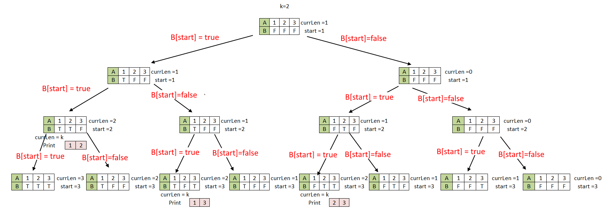

# Thuật toán trong an toàn thông tin

### NOTE: List được tổng hợp từ nhiều nguồn tài liệu và code by Trần Tuấn Đạt KMA

### Bài 1 Một số gọi là Q-prime khi nó có đúng 4 ước số nguyên dương. Hãy viết chương trình in ra các số Q-Prime nhỏ hơn hoặc bằng một số N cho trước nhập từ bàn phím.

```c
#include <stdio.h>
#include <stdbool.h>
#include<math.h>

bool check(int n)
{
    int count = 0;
    for (int i = 1; i <= sqrt(n); i++)
    {
        if (n % i == 0)
        {
            if (n / i == i)
            {
                count++;
            }
            else
            {
                count += 2;
            }
        }
    }
    return count == 4;
}
int main()
{
    int n;
    scanf("%d", &n);
    if (n <= 4)
    {
        printf("No");
        return 0;
    }

    for (int i = 0; i <= n; i++)
    {
        if (check(i))
            printf("%d\n", i);
    }
    return 0;
}
```

### Bài 2: Viết chương trình tìm các số nguyên tố có N chữ số với N nhập từ bàn phím và 2 ≤ N ≤ 10.

```java
package ex;

import java.util.*;
import java.lang.Math;

public class Solution {
	public static void fillPrime(ArrayList<Integer> chprime, int high) {
		boolean[] ck = new boolean[high + 1];
		Arrays.fill(ck, true);
		ck[1] = false;
		ck[0] = false;

		for (int i = 2; (i * i) <= high; i++) {
			if (ck[i] == true) {
				for (int j = i * i; j <= Math.sqrt(high); j = j + i) {
					ck[j] = false;
				}
			}
		}
		for (int i = 2; i * i <= high; i++) {
			if (ck[i] == true) {
				chprime.add(i);
			}
		}
	}

	public static void segmentedSieve(int low, int high) {
		ArrayList<Integer> chprime = new ArrayList<Integer>();
		fillPrime(chprime, high);
		boolean[] prime = new boolean[high - low + 1];
		Arrays.fill(prime, true);
		for (int i : chprime) {
			int lower = (low / i);
			if (lower <= 1) {
				lower = i + i;
			} else if (low % i != 0) {
				lower = (lower * i) + i;
			} else {
				lower = (lower * i);
			}
			for (int j = lower; j <= high; j = j + i) {
				prime[j - low] = false;
			}
		}
		for (int i = low; i <= high; i++) {
			if (prime[i - low] == true) {
				System.out.printf("%d\n", i);
			}
		}
	}

	public static void main(String[] args) {
		Scanner sc = new Scanner(System.in);
		int n;
		System.out.println("Nhập n: ");
		n = sc.nextInt();
		int left = (int) Math.pow(10, n - 1);
	    int right = (int) (Math.pow(10, n) - 1);
		segmentedSieve(left, right);
	}
}
```

### Bài 3. Cho một số nguyên dương N, gọi:

- k là số ước nguyên tố của N;
- q là tổng của các ước nguyên tố của N;
- p là tổng của các ước số của N;
- s là số ước của N;

```c
#include <stdio.h>
int main()
{
    int N, p, s, q, k, i, dem, Tong, t;
    p = s = q = k = i = Tong = 0;
    printf("Nhap so N duong ");
    scanf("%d", &N);
    int a[N + 1];
    for (i = 2; i <= N; i++)
    {
        a[i] = 1;
    }
    for (p = 2; p < N; p++)
    {
        t = N / p;
        for (i = 2; i <= t; i++)
            a[p * i] = 0;
    }
    for (i = 2; i <= N; i++)
    {
        if ((a[i] == 1) && (N % i == 0))
        {
            q = q + i;
            k++;
        }
    }
    p = 0;
    for (i = 1; i <= N; i++)
    {
        if (N % i == 0)
        {
            p = p + i;
            s++;
        }
    }
    Tong = N + p + s - q - k;
    printf("Vay ket qua la %d+%d+%d-%d-%d=%d", N, p, s, q, k, Tong);
}
```

### Bài 4: Viết chương trình đếm số số nguyên tố nằm trong khoảng [A,B] với A, B nhập vào từ bàn phím.

- EXPLAIN:

1. Sử dụng sàng đơn giản để tìm ra tất cả các số nguyên tố từ 2 đến căn bậc 2 của b, và lưu trữ các số nguyên tố này trong một mảng.
2. Tạo một mảng đánh dấu: [high - low + 1]
3. Lặp lại tất cả các số nguyên tố được tìm thấy ở bước 1, Đối với số nguyên tố, hãy đánh dấu bội số của nó trong phạm vi từ [low, high]

- NX: Vì vậy, không giống như sàng đơn giản, không kiểm tra tất cả bội số của mọi số nhỏ hơn căn bậc hai của high, chỉ kiểm tra bội số của các số nguyên tố được tìm thấy ở bước 1. Và không cần space O(high), cần O (sqrt(high) + n) không gian.

```java
package ex;

import java.util.*;
import java.lang.Math;

public class Solution {
	public static void fillPrime(ArrayList<Integer> chprime, int high) {
		boolean[] ck = new boolean[high + 1];
		Arrays.fill(ck, true);
		ck[1] = false;
		ck[0] = false;

		for (int i = 2; (i * i) <= high; i++) {
			if (ck[i] == true) {
				for (int j = i * i; j <= Math.sqrt(high); j = j + i) {
					ck[j] = false;
				}
			}
		}
		for (int i = 2; i * i <= high; i++) {
			if (ck[i] == true) {
				chprime.add(i);
			}
		}
	}

	public static void segmentedSieve(int low, int high) {
		ArrayList<Integer> chprime = new ArrayList<Integer>();
		fillPrime(chprime, high);
		boolean[] prime = new boolean[high - low + 1];
		Arrays.fill(prime, true);
		for (int i : chprime) {
			int lower = (low / i);
			if (lower <= 1) {
				lower = i + i;
			} else if (low % i != 0) {
				lower = (lower * i) + i;
			} else {
				lower = (lower * i);
			}
			for (int j = lower; j <= high; j = j + i) {
				prime[j - low] = false;
			}
		}
		int count = 0;
		for (int i = low; i <= high; i++) {
			if (prime[i - low] == true) {
				System.out.printf("%d ", i);
				count++;
			}
		}
		System.out.println("\nSố lượng số nguyên tố trong khoảng " + low + "-" + high + " là: " + count);
	}

	public static void main(String[] args) {
		Scanner sc = new Scanner(System.in);
		int a, b;
		System.out.println("Nhập a: ");
		a = sc.nextInt();
		System.out.println("Nhập b: ");
		b = sc.nextInt();
		segmentedSieve(a, b);
	}
}
```

### Bài 5: Viết chương trình tính tổng của các số nguyên tố nằm trong khoảng [A, B] với A, B nhập vào từ bàn phím.

```java
package ex;
import java.util.*;
import java.lang.Math;

public class Solution {
	public static void fillPrime(ArrayList<Integer> chprime, int high) {
		boolean[] ck = new boolean[high + 1];
		Arrays.fill(ck, true);
		ck[1] = false;
		ck[0] = false;

		for (int i = 2; (i * i) <= high; i++) {
			if (ck[i] == true) {
				for (int j = i * i; j <= Math.sqrt(high); j = j + i) {
					ck[j] = false;
				}
			}
		}
		for (int i = 2; i * i <= high; i++) {
			if (ck[i] == true) {
				chprime.add(i);
			}
		}
	}

	public static void segmentedSieve(int low, int high) {
		ArrayList<Integer> chprime = new ArrayList<Integer>();
		fillPrime(chprime, high);
		boolean[] prime = new boolean[high - low + 1];
		Arrays.fill(prime, true);
		for (int i : chprime) {
			int lower = (low / i);
			if (lower <= 1) {
				lower = i + i;
			} else if (low % i != 0) {
				lower = (lower * i) + i;
			} else {
				lower = (lower * i);
			}
			for (int j = lower; j <= high; j = j + i) {
				prime[j - low] = false;
			}
		}
		int total = 0;
		for (int i = low; i <= high; i++) {
			if (prime[i - low] == true) {
				total += i;
			}
		}
		System.out.println("Total: " + total);
	}
	public static void main(String[] args) {
		Scanner sc = new Scanner(System.in);
		int a, b;
		System.out.println("Enter a: ");
		a = sc.nextInt();
		System.out.println("Enter b: ");
		b = sc.nextInt();
		segmentedSieve(a, b);
	}
}
```

### Bài 6: Cặp số thân thiết

```java
package ex;

import java.util.Scanner;

public class Solution {

    static Scanner scanner = new Scanner(System.in);

    public static long sumOfDivisior(long n) {
        long sum = 1;
        for (long i = 2; i*i < n; i++) {
            if (n % i == 0) {
                if (n / i == i) {
                    sum += 1;
                }else{
                    sum += (i + (n / i));
                }
            }
        }
        return sum;
    }

    public static void main(String[] args) {
        long n;
        n = scanner.nextLong();
        for (long i = 1; i <= n; i++) {
            long a = sumOfDivisior(i);
            if (i == sumOfDivisior(a) && a != i && a < n && i < a) {
                System.out.println(i + " " + a);
            }
        }
    }
}
```

### Bài 7: số Emirp

```java
package ex;

import java.util.Scanner;
public class Solution {
	static Scanner sc = new Scanner(System.in);
	static boolean isPrime(int n) {
		// Corner cases
		if (n <= 1)
			return false;
		if (n <= 3)
			return true;

		// This is checked so that we can skip
		// middle five numbers in below loop
		if (n % 2 == 0 || n % 3 == 0)
			return false;
		// all prime number has format: 6k +- 1, exclude 2, 3
		for (int i = 5; i * i <= n; i = i + 6)
			if (n % i == 0 || n % (i + 2) == 0)
				return false;

		return true;
	}

	static int reverse(int n) {

		int rev = 0; // reversed number
		int rem; // remainder

		while (n > 0) {

			rem = n % 10;
			rev = (rev * 10) + rem;
			n = n / 10;
		}

		return rev;
	}

	public static void main(String[] args) {
		int n = sc.nextInt();
		for(int i = 2; i < n; i++) {
			if(isPrime(i) && isPrime(reverse(i))) {
				System.out.println(i);
			}
		}
	}
}
```

### Bài 8: Т-prime

```c
#include <stdio.h>
#include <stdbool.h>
#include <math.h>

bool checkTTPrime(int n)
{
    int count = 0;
    for (int i = 1; i <= sqrt(n); i++)
    {
        if (n % i == 0)
        {
            if (n / i == i)
            {
                count++;
            }
            else
            {
                count += 2;
            }
        }
    }
    return count == 3;
}
int main()
{
    int n;
    scanf("%d", &n);
    if (n < 4)
    {
        printf("No");
        return 0;
    }

    for (int i = 0; i < n; i++)
    {
        if (checkTTPrime(i))
            printf("%d\n", i);
    }
    return 0;
}
```

### Bài 9: SL Số nguyên tố nhỏ hơn hoặc bằng n

```java
package ex;

import java.util.Scanner;

public class Solution {
	static Scanner sc = new Scanner(System.in);

	public static int countNumberOfPrime(int n) {
		// Create a boolean array "prime[0..n]" and initialize
		// all entries it as true. A value in prime[i] will
		// finally be false if i is Not a prime, else true.
		boolean prime[] = new boolean[n + 1];
		for (int i = 0; i <= n; i++)
			prime[i] = true;

		for (int p = 2; p * p <= n; p++) {
			// If prime[p] is not changed, then it is a prime
			if (prime[p] == true) {
				// Update all multiples of p
				for (int i = p * p; i <= n; i += p)
					prime[i] = false;
			}
		}

		// Count all prime numbers
		int count = 0;
		for (int i = 2; i <= n; i++) {
			if (prime[i] == true)
				count++;
		}
		return count;
	}

	public static void main(String[] args) {
		int n = sc.nextInt();
		System.out.println("Number: " + countNumberOfPrime(n));
	}
}
```

### Bài 10: Viết chương trình đếm số ước và số ước nguyên tố của một số N nhập vào từ bàn phím.

```java
package ex;

import java.util.Scanner;

public class Solution {
	static Scanner sc = new Scanner(System.in);

	public static boolean isPrime(int n) {
		if (n <= 1)
			return false;

		// Check if n=2 or n=3
		if (n == 2 || n == 3)
			return true;

		// Check whether n is divisible by 2 or 3
		if (n % 2 == 0 || n % 3 == 0)
			return false;

		// Check from 5 to square root of n
		// Iterate i by (i+6)
		for (int i = 5; i <= Math.sqrt(n); i = i + 6)
			if (n % i == 0 || n % (i + 2) == 0)
				return false;

		return true;
	}

	// method to print the divisors
	static void printDivisors(int n) {
		// Note that this loop runs till square root
		int coutDivisors = 0, countPrimeDivisors = 0;
		for (int i = 1; i <= Math.sqrt(n); i++) {
			if (n % i == 0) {
				// If divisors are equal, print only one
				if (n / i == i) {
					coutDivisors++;
					if (isPrime(i))
						countPrimeDivisors++;
				} else {
					coutDivisors += 2;
					if (isPrime(i)) {
						countPrimeDivisors++;
					}
					if (isPrime(n / i)) {
						countPrimeDivisors++;
					}
				}
			}
		}
		System.out.println("countPrimeDivisors: " + countPrimeDivisors);
		System.out.println("coutDivisors: " + coutDivisors);
	}

	public static void main(String[] args) {
		int n = sc.nextInt();
		printDivisors(n);
	}
}
```

### Bài 11: Viết chương trình tính tổng của các số nguyên tố nhỏ hơn hoặc bằng N với N được nhập từ bàn phím.

```java
package ex;

import java.util.Scanner;

public class Solution {
	static Scanner sc = new Scanner(System.in);

	public static int totalNumberOfPrime(int n) {
		// Create a boolean array "prime[0..n]" and initialize
		// all entries it as true. A value in prime[i] will
		// finally be false if i is Not a prime, else true.
		boolean prime[] = new boolean[n + 1];
		for (int i = 0; i <= n; i++)
			prime[i] = true;

		for (int p = 2; p * p <= n; p++) {
			// If prime[p] is not changed, then it is a prime
			if (prime[p] == true) {
				// Update all multiples of p
				for (int i = p * p; i <= n; i += p)
					prime[i] = false;
			}
		}

		// Count all prime numbers
		int total = 0;
		for (int i = 2; i <= n; i++) {
			if (prime[i] == true)
				total += i;
		}
		return total;
	}

	public static void main(String[] args) {
		int n = sc.nextInt();
		System.out.println("Number: " + totalNumberOfPrime(n));
	}
}
```

### Bài 12: Viết chương trình tìm bốn số nguyên tố liên tiếp, sao cho tổng của chúng là số nguyên tố nhỏ hơn hoặc bằng N (với N được nhập vào từ bàn phím).

```c
#include <stdio.h>
#include <stdbool.h>
#include <string.h>

int isPrime(int n)
{
    // Check if n=1 or n=0
    if (n <= 1)
        return 0;
    // Check if n=2 or n=3
    if (n == 2 || n == 3)
        return 1;
    // Check whether n is divisible by 2 or 3
    if (n % 2 == 0 || n % 3 == 0)
        return 0;
    // Check from 5 to square root of n
    // Iterate i by (i+6)
    for (int i = 5; i * i <= n; i = i + 6)
        if (n % i == 0 || n % (i + 2) == 0)
            return 0;

    return 1;
}

int SieveOfEratosthenes(int n, int arr[])
{
    bool prime[n + 1];
    memset(prime, true, sizeof(prime));
    for (int p = 2; p * p <= n; p++)
    {
        if (prime[p] == true)
        {
            for (int i = p * p; i <= n; i += p)
            {
                prime[i] = false;
            }
        }
    }

    int k = 0;
    for (int p = 2; p <= n; p++)
    {
        if (prime[p])
        {
            arr[k] = p;
            k++;
        }
    }
    return k;
}
int main()
{
    int n;
    scanf("%d", &n);
    int arr[n];
    int k = SieveOfEratosthenes(n, arr);
    for (int i = 0; i < k - 3; i++)
    {
        int a1 = arr[i];
        int a2 = arr[i + 1];
        int a3 = arr[i + 2];
        int a4 = arr[i + 3];
        if (isPrime(a1 + a2 + a3 + a4) == 1 && a1 + a2 + a3 + a4 <= n)
        {
            printf("%d %d %d %d", a1, a2, a3, a4);
            return;
        }
    }
    return 0;
}
```

### Bài 13: Viết chương trình tìm hai số nguyên tố nhỏ hơn hoặc bằng N với N nhập vào từ bàn phím, sao cho tổng và hiệu của chúng đều là số nguyên tố.

```c
#include <stdio.h>
#include <stdlib.h>
int kiemtraSNT(int n)
{
    // Check if n=1 or n=0
    if (n <= 1)
        return 0;
    // Check if n=2 or n=3
    if (n == 2 || n == 3)
        return 1;
    // Check whether n is divisible by 2 or 3
    if (n % 2 == 0 || n % 3 == 0)
        return 0;
    // Check from 5 to square root of n
    // Iterate i by (i+6)
    for (int i = 5; i * i <= n; i = i + 6)
        if (n % i == 0 || n % (i + 2) == 0)
            return 0;

    return 1;
}

int main()
{
    int n;
    printf("Nhap n: ");
    scanf("%d", &n);
    if (n < 2)
    {
        printf("\nNhap n>=2. Moi nhap lai.");
        printf("Nhap n: ");
        scanf("%d", &n);
    }
    int i, j;
    for (i = 2; i <= n; i++)
    {
        if (kiemtraSNT(i) == 1)
        {
            for (j = i; j <= n; j++)
            {
                if (kiemtraSNT(j) == 1)
                {
                    int tong = i + j;
                    int hieu = abs(i - j);
                    if (kiemtraSNT(tong) == 1 && kiemtraSNT(hieu) == 1)
                    {
                        printf("\nHai so nguyen to can tim la: %d va %d", i, j);
                    }
                }
            }
        }
    }
    return 0;
}
```

### Bài 14: Viết chương trình tìm số nguyên tố có ba chữ số, biết rằng nếu viết số đó theo thứ tự ngược lại thì ta được một số là lập phương của một số tự nhiên.

```java
package ex;

import java.util.*;
import java.lang.Math;

public class Solution {

	static int reverse(int n) {

		int rev = 0; // reversed number
		int rem; // remainder

		while (n > 0) {

			rem = n % 10;
			rev = (rev * 10) + rem;
			n = n / 10;
		}

		return rev;
	}

	public static void fillPrime(ArrayList<Integer> chprime, int high) {
		boolean[] ck = new boolean[high + 1];
		Arrays.fill(ck, true);
		ck[1] = false;
		ck[0] = false;

		for (int i = 2; (i * i) <= high; i++) {
			if (ck[i] == true) {
				for (int j = i * i; j <= Math.sqrt(high); j = j + i) {
					ck[j] = false;
				}
			}
		}
		for (int i = 2; i * i <= high; i++) {
			if (ck[i] == true) {
				chprime.add(i);
			}
		}
	}

	public static void segmentedSieve(int low, int high) {
		ArrayList<Integer> chprime = new ArrayList<Integer>();
		fillPrime(chprime, high);
		boolean[] prime = new boolean[high - low + 1];
		Arrays.fill(prime, true);
		for (int i : chprime) {
			int lower = (low / i);
			if (lower <= 1) {
				lower = i + i;
			} else if (low % i != 0) {
				lower = (lower * i) + i;
			} else {
				lower = (lower * i);
			}
			for (int j = lower; j <= high; j = j + i) {
				prime[j - low] = false;
			}
		}
		for (int i = low; i <= high; i++) {
			if (prime[i - low] == true && Math.cbrt(reverse(i)) == Math.round(Math.cbrt(reverse(i)))) {
				System.out.println(i);
			}
		}
	}

	public static void main(String[] args) {
		Scanner sc = new Scanner(System.in);
		int left = (int) Math.pow(10, 2);
		int right = (int) (Math.pow(10, 3) - 1);
		segmentedSieve(left, right);
	}
}
```

### Bài 15 Viết chương trình Hai số nguyên tố sinh đôi là hai số nguyên tố hơn kém nhau 2 đơn vị. Tìm hai số nguyên tố sinh đôi nhỏ hơn hoặc bằng N, với N được nhập vào từ bàn phím.

```java
package ex;

import java.util.*;
import java.lang.Math;

public class Solution {

	public static boolean isPrime(int n) {
		if (n <= 1)
			return false;

		// Check if n=2 or n=3
		if (n == 2 || n == 3)
			return true;

		// Check whether n is divisible by 2 or 3
		if (n % 2 == 0 || n % 3 == 0)
			return false;

		// Check from 5 to square root of n
		// Iterate i by (i+6)
		for (int i = 5; i <= Math.sqrt(n); i = i + 6)
			if (n % i == 0 || n % (i + 2) == 0)
				return false;

		return true;
	}

	public static void main(String[] args) {
		Scanner sc = new Scanner(System.in);
		int n = sc.nextInt();
		for(int i = 2; i <= n - 2; i++) {
			if(isPrime(i) && isPrime(i + 2)) {
				System.out.println(i + " " + (i + 2));
			}
		}
	}
}
```

### Bài 16: Viết chương trình tìm các số nguyên tố từ một mảng sinh ngẫu nhiên có kích thước N, với N nhập vào từ bàn phím.

```c
#include <stdio.h>
#include <math.h>
int main()
{
    int check, n, i, j, ra;

    printf("Nhap so n: ");
    scanf("%d", &n);
    for (j = 0; j < n; j++)
    {
        check = 1;
        ra = rand();
        printf("%d", ra);
        for (i = 2; i < sqrt(ra); i++)
        {
            if (ra % i == 0)
                check = 0;
        }
        if (check == 1)
            printf(" Day la so nguyen to\n");
        else
            printf(" Day khong phai la so nguyen to\n");
    }
}
```

### Bài 17:

- Viết chương trình tìm số nguyên dương x nhỏ nhất và nhỏ hơn N nhập từ bàn phím sao cho giá trị của biểu thức Ax^2 + Bx + C là một số nguyên tố với A,B,C là các số nguyên nhập vào từ bàn phím.

```c
#include <stdio.h>
#include <math.h>
int main()
{
    int check, n, i, j, ra, x, A, B, C;

    printf("Nhap so n: ");
    scanf("%d", &n);
    printf("Nhap A: ");
    scanf("%d", &A);
    printf("Nhap B: ");
    scanf("%d", &B);
    printf("Nhap C: ");
    scanf("%d", &C);
    for (x = 1; x < n; x++)
    {
        check = 1;
        ra = A * x * x + B * x + C;
        for (i = 2; i < sqrt(ra); i++)
        {
            if (ra % i == 0)
                check = 0;
        }
        if (check == 1)
        {
            printf("%d la so nguyen to cua tong A.x^2+B.x+C=%d\n", x, ra);
            break;
        }
        if ((check == 0) && (x == (n - 1)))
            printf("Khong co gia tri thoa man");
    }
}

```

### Bài 18:

- Áp dụng thuật toán đã được học để viết chương trình tính tổng của hai số nguyên lớn,
  hiển thị dưới mạng mảng và dạng số nguyên.
- Bài này đã code trên java

### Bài 19:

- Viết chương trình in ra các số nguyên dương x nằm trong khoảng [m,l] sao cho giá trị
  của biểu thức Ax^2 + Bx + C là một số nguyên tố. Với A,B,C, m,l là các số nguyên nhập từ bàn phím (m<l).

```c
#include <stdio.h>
#include <math.h>
int main()
{
    int check, m, l, i, j, ra, x, A, B, C, check2;

    check2 = 0;

    printf("Nhap so m: ");
    scanf("%d", &m);
    printf("Nhap so l>m nhe: ");
    scanf("%d", &l);
    printf("Nhap A: ");
    scanf("%d", &A);
    printf("Nhap B: ");
    scanf("%d", &B);
    printf("Nhap C: ");
    scanf("%d", &C);
    for (x = m; x <= l; x++)
    {
        check = 1;
        ra = A * x * x + B * x + C;
        for (i = 2; i < sqrt(ra); i++)
        {
            if (ra % i == 0)
                check = 0;
        }
        if (check == 1)
        {
            printf("%d la so nguyen to cua tong A.x^2+B.x+C=%d\n", x, ra);
            check2 = 1;
        }
    }
    if ((check2 == 0) && ((x - 1) == l))
        printf("Khong co gia tri thoa man");
}
```

### Bài 20:

- Viết chương trình in ra các cặp số (A,B) nằm trong khoảng (M,N) sao cho ước số chung
  lớn nhất của A và B có giá trị là một số D cho trước. Với M,N,D nhập vào từ bàn phím. (0<M,N,D < 1000).

```java
package ex;

import java.util.*;
import java.lang.Math;

public class Solution {
	static Scanner sc = new Scanner(System.in);

	public static int gcd(int l, int b) {
		while (b > 0) {
			int r = l % b;
			l = b;
			b = r;
		}
		return l;
	}

	public static void main(String[] args) {
		int m, n, d;
		m = sc.nextInt();
		n = sc.nextInt();
		d = sc.nextInt();

		for (int i = m + 1; i < n - d; i++) {
			for (int j = i + d; j < n; j += d) {
				if (i % d != 0)
					break;
				if (gcd(i, j) == d) {
					System.out.println(i + "-" + j);
				}
			}
		}
	}
}
```

### Bài 21:

- Một số gọi là siêu số nguyên tố nếu số lượng các số nguyên tố từ 1 đến X (ngoại trừ X) là
  một số nguyên tố. Hãy viết chương trình đếm số lượng các siêu số nguyên tố này trong khoảng
  [A,B] cho trước nhập từ bàn phím.

```c
#include <stdio.h>
#include <stdbool.h>

bool checkPrime(int n)
{
    int i;
    if (n < 2)
        return false;
    if (n == 2 || n == 3)
        return true;
    if (n % 2 == 0 || n % 3 == 0)
        return false;
    for (i = 5; i * i < n; i = i + 6)
    {
        if (n % i == 0 || n % (i + 2) == 0)
            return false;
        return true;
    }
}
int main()
{
    int a, b, i, j;
    printf("Nhap a: ");
    scanf("%d", &a);
    printf("\nNhap b: ");
    scanf("%d", &b);
    int count = 0;
    // duyệt các số siêu nguyên tố từ A đến B
    for (i = a; i <= b; i++)
    {
        int prime_count = 0;

        // tính số lượng số nguyên tố , j < i để k bao gồm số i
        for (j = 1; j < i; j++)
        {
            if (checkPrime(j))
                prime_count++;
        }

        if (checkPrime(prime_count))
            count++;
    }
    printf("So luong so sieu  nguyen to trong khoang [%d,%d] la: %d\n", a, b, count);
    return 0;
}
```

### Bài 22:

- Với một số nguyên dương N thoả mãn 0<N<10000, đặt:
  F ( N ) = N nếu N là một số nguyên tố
  F ( N ) = 0 nếu là hợp số
  Cho L và R nhập vào từ bàn phím, với mọi cặp i , j trong khoảng [ L , R ] hãy viết chương trình
  in ra màn hình giá trị tổng của F ( i ) \* F ( j ) với j > i.

```java
package ex;

import java.io.*;
import java.math.*;
import java.util.Scanner;

class Solution {
	static Scanner sc = new Scanner(System.in);

	/*
	 * Iterative Function to calculate // (a^n)%p in O(logy)
	 */
	// Nhân bình phương có lặp
	static int power(int a, int n, int p) {
		// Initialize result
		int res = 1;

		// Update 'a' if 'a' >= p
		a = a % p;

		while (n > 0) {
			// If n is odd, multiply 'a' with result
			if ((n & 1) == 1)
				res = (res * a) % p;

			// n must be even now
			n = n >> 1; // n = n/2
			a = (a * a) % p;
		}
		return res;
	}

	// If n is prime, then always returns true,
	// If n is composite than returns false with
	// high probability Higher value of k increases
	// probability of correct result
	// Fermat
	static boolean isPrime(int n, int k) {
		// Corner cases
		if (n <= 1 || n == 4)
			return false;
		if (n <= 3)
			return true;

		// Try k times
		while (k > 0) {
			// Pick a random number in [2..n-2]
			// Above corner cases make sure that n > 4
			int a = 2 + (int) (Math.random() % (n - 4));

			// Fermat's little theorem
			if (power(a, n - 1, n) != 1)
				return false;

			k--;
		}

		return true;
	}

	public static int calcFermat(int n, int k) {
		if (isPrime(n, k)) {
			return n;
		}
		return 0;
	}

	// Driver Program
	public static void main(String args[]) {
		// safety parameter ( >= 1, init 3)
		int k = 3;
		int l = sc.nextInt();
		int r = sc.nextInt();
		int sum = 0;
		for (int i = l; i < r; i++) {
			for (int j = i + 1; j <= r; j++) {
				if (j > i) {
					System.out.println(
							"F[" + i + "] *" + " F[" + j + "] = " + calcFermat(i, k) + " + " + calcFermat(j, k));
					sum += calcFermat(i, k) * calcFermat(j, k);
				}
			}
		}
		System.out.println("Sum: " + sum);
	}
}
```

### Bài 23:

- Viết chương trình in ra màn hình YES trong trường hợp tổng của các số nguyên tố trong
  khoảng [A, B] là cũng là một số nguyên tố và NO nếu ngược lại. Với A,B là hai số được nhập vào
  từ bàn phím.

```java
package ex;

import java.util.*;
import java.lang.Math;

public class Solution {
	public static void fillPrime(ArrayList<Integer> chprime, int high) {
		boolean[] ck = new boolean[high + 1];
		Arrays.fill(ck, true);
		ck[1] = false;
		ck[0] = false;

		for (int i = 2; (i * i) <= high; i++) {
			if (ck[i] == true) {
				for (int j = i * i; j <= Math.sqrt(high); j = j + i) {
					ck[j] = false;
				}
			}
		}
		for (int i = 2; i * i <= high; i++) {
			if (ck[i] == true) {
				chprime.add(i);
			}
		}
	}

	static boolean isPrime(int n) {
		// Corner cases
		if (n <= 1)
			return false;
		if (n <= 3)
			return true;

		// This is checked so that we can skip
		// middle five numbers in below loop
		if (n % 2 == 0 || n % 3 == 0)
			return false;
		// all prime number has format: 6k +- 1, exclude 2, 3
		for (int i = 5; i * i <= n; i = i + 6)
			if (n % i == 0 || n % (i + 2) == 0)
				return false;

		return true;
	}

	public static void segmentedSieve(int low, int high) {
		ArrayList<Integer> chprime = new ArrayList<Integer>();
		fillPrime(chprime, high);
		boolean[] prime = new boolean[high - low + 1];
		Arrays.fill(prime, true);
		for (int i : chprime) {
			int lower = (low / i);
			if (lower <= 1) {
				lower = i + i;
			} else if (low % i != 0) {
				lower = (lower * i) + i;
			} else {
				lower = (lower * i);
			}
			for (int j = lower; j <= high; j = j + i) {
				prime[j - low] = false;
			}
		}
		int sum = 0;
		for (int i = low; i <= high; i++) {
			if (prime[i - low] == true) {
				sum += i;
			}
		}
		if(isPrime(sum)) {
			System.out.println("YES");
			return;
		}
		System.out.println("NO");
	}

	public static void main(String[] args) {
		Scanner sc = new Scanner(System.in);
		int left = sc.nextInt();
		int right = sc.nextInt();
		segmentedSieve(left, right);
	}
}
```

### Bài 24:

- Đặt S1, S2 là các mảng chứa giá trị bình phương của các số nguyên. Hãy viết chương
  trình in ra số lượng tất cả các số nguyên tố nằm trong khoảng [a,b] sao cho số này cũng là tổng
  của hai số x và y với x thuộc S1 và y thuộc S2. Trong đó, a,b là các số được nhập từ bàn phím
  Ví dụ: với a=10, b =15, in ra giá trị là 1 vì trong khoảng [10,15] chỉ có 2 số nguyên tố 11 và 13,
  nhưng chỉ có 13 = 2^2 + 3^2=4+9.

```java
package ex;

import java.util.*;
import java.lang.Math;

public class Solution {
	public static void fillPrime(ArrayList<Integer> chprime, int high) {
		boolean[] ck = new boolean[high + 1];
		Arrays.fill(ck, true);
		ck[1] = false;
		ck[0] = false;

		for (int i = 2; (i * i) <= high; i++) {
			if (ck[i] == true) {
				for (int j = i * i; j <= Math.sqrt(high); j = j + i) {
					ck[j] = false;
				}
			}
		}
		for (int i = 2; i * i <= high; i++) {
			if (ck[i] == true) {
				chprime.add(i);
			}
		}
	}

	static boolean isPrime(int n) {
		// Corner cases
		if (n <= 1)
			return false;
		if (n <= 3)
			return true;

		// This is checked so that we can skip
		// middle five numbers in below loop
		if (n % 2 == 0 || n % 3 == 0)
			return false;
		// all prime number has format: 6k +- 1, exclude 2, 3
		for (int i = 5; i * i <= n; i = i + 6)
			if (n % i == 0 || n % (i + 2) == 0)
				return false;

		return true;
	}

	public static boolean checkExponential(ArrayList<Integer> s1, ArrayList<Integer> s2, int sum) {
		for(int i = 0; i < s1.size() - 1; i++) {
			for(int j = i; j < s1.size(); j++) {
				if(s1.get(i) + s2.get(j) == sum) {
					System.out.println(sum + " = " + s1.get(i) + " + " + s1.get(j));
					return true;
				}
			}
		}
		return false;
	}

	public static void segmentedSieve(int low, int high) {
		ArrayList<Integer> chprime = new ArrayList<Integer>();
		fillPrime(chprime, high);
		ArrayList<Integer> s1 = new ArrayList<>();
		ArrayList<Integer> s2 = new ArrayList<>();
		for(int i = 1; i <= Math.sqrt(high); i++) {
			s1.add(i * i);
		}
		s2 = (ArrayList<Integer>)s1.clone();

		boolean[] prime = new boolean[high - low + 1];
		Arrays.fill(prime, true);
		for (int i : chprime) {
			int lower = (low / i);
			if (lower <= 1) {
				lower = i + i;
			} else if (low % i != 0) {
				lower = (lower * i) + i;
			} else {
				lower = (lower * i);
			}
			for (int j = lower; j <= high; j = j + i) {
				prime[j - low] = false;
			}
		}
		int count = 0;
		for (int i = low; i <= high; i++) {
			if (prime[i - low] == true) {
				if(checkExponential(s1, s2, i)) {
					count++;
				}
			}
		}
		System.out.println("Count: " + count);
	}

	public static void main(String[] args) {
		Scanner sc = new Scanner(System.in);
		int a = sc.nextInt();
		int b = sc.nextInt();
		segmentedSieve(a, b);
	}
}
```

### Bài 25:

- Cho 2 số M và N thoả mãn điều kiện: 1<=N<=10000; 2<M<=100; Hãy viết chương trình
  xác định xem số N có thể được phân tích thành tổng của M số nguyên tố hay không? Nếu có thì in
  ra các số đó.

- Ý tưởng thuật toán:

  - B1: Sử dụng thuật toán sàng nguyên tố để lấy ra tất cả các số nguyên tố từ 1 - n
  - B2: Sử dụng thuật toán để lấy tất cả các mảng con chứa m phần tử trong mảng được lấy từ B1
  - B3: Kiểm tra nếu n được phân tách bởi tổng của các số nguyên tố trong từng mảng con ở bước 2

- Minh họa thuật toán ở B2



```js
const prompt = require("prompt-sync")();
function sangEratosthenes(n) {
  let check = new Array(n + 1).fill(true);
  for (let i = 2; i <= n; i++) {
    if (check[i] == true) {
      for (let j = 2 * i; j <= n; j += i) {
        check[j] = false;
      }
    }
  }
  let result = [];
  for (let i = 2; i <= n; i++) {
    if (check[i]) {
      result.push(i);
      1;
    }
  }
  return result;
}

function subArr(arr, k, start, currlen, B, n) {
  if (currlen === k) {
    let a = [];
    for (let i = 0; i < arr.length; i++) {
      if (B[i] === true) {
        a.push(arr[i]);
      }
    }
    if (sum(a) === n) {
      console.log(a);
    }
    return;
  }
  if (start === arr.length) {
    return;
  }
  B[start] = true;
  subArr(arr, k, start + 1, currlen + 1, B, n);

  B[start] = false;
  subArr(arr, k, start + 1, currlen, B, n);
}

function sum(arr) {
  return arr.reduce((a, b) => a + b, 0);
}

function run() {
  const n = prompt("Enter n: ");
  const m = prompt("Enter m: ");
  const arr = sangEratosthenes(+n);
  let B = new Array(arr.length).fill(false);
  subArr(arr, +m, 0, 0, B, +n);
}

run();
```

### Bài 26:

- Một số được gọi là số mạnh mẽ khi nó đồng thời vừa chia hết cho số nguyên tố và chia
  hết cho bình phương của số nguyên tố đó. Tìm số mạnh mẽ nhỏ hơn số N cho trước (N < 10000).

```c
#include <stdio.h>
#include <stdbool.h>
#include <math.h>

int isPrime(int n)
{
    // Check if n=1 or n=0
    if (n <= 1)
        return 0;
    // Check if n=2 or n=3
    if (n == 2 || n == 3)
        return 1;
    // Check whether n is divisible by 2 or 3
    if (n % 2 == 0 || n % 3 == 0)
        return 0;
    // Check from 5 to square root of n
    // Iterate i by (i+6)
    for (int i = 5; i * i <= n; i = i + 6)
        if (n % i == 0 || n % (i + 2) == 0)
            return 0;

    return 1;
}

bool check(int n)
{
    for (int i = 1; i <= sqrt(n); i++)
    {
        if (n % i == 0)
        {
            if (n / i == i)
            {
                if (isPrime(i) == 1 && n % (i * i) == 0)
                {
                    return true;
                }
            }
            else
            {
                if ((isPrime(i) == 1 && n % (i * i) == 0) || (isPrime((n / i)) == 1) && n % ((n / i) * (n / i)) == 0)
                {
                    return true;
                }
            }
        }
    }
    return false;
}
int main()
{
    int n;
    scanf("%d", &n);
    for (int i = 1; i < n; i++)
    {
        if (check(i))
        {
            printf("%d ", i);
        }
    }
    return 0;
}
```

# **Phần 2: Phần nâng cao**

### Bài 27

- Viết chương trình in ra các cặp số (a,b) thoả mãn điều kiện 0<a,b<1000, sao cho ước
  chung lớn nhất của 2 số đó là một số nguyên tố.

```c
#include <stdio.h>
#include <math.h>
int gcd(int l, int b)
{
    while (b > 0)
    {
        int r = l % b;
        l = b;
        b = r;
    }
    return l;
}

int isPrime(int n)
{
    // Check if n=1 or n=0
    if (n <= 1)
        return 0;
    // Check if n=2 or n=3
    if (n == 2 || n == 3)
        return 1;
    // Check whether n is divisible by 2 or 3
    if (n % 2 == 0 || n % 3 == 0)
        return 0;
    // Check from 5 to square root of n
    // Iterate i by (i+6)
    for (int i = 5; i * i <= n; i = i + 6)
        if (n % i == 0 || n % (i + 2) == 0)
            return 0;

    return 1;
}

int main()
{
    int a = 1, b = 9;
    int i, j;
    for (i = a; i < b; i++)
    {
        for (j = a; j < b; j++)
        {
            int d = gcd(i, j);
            if (isPrime(d) == 1)
            {
                printf("[%d %d]\n", i, j);
            }
        }
    }
}
```

### Bài 28:

- Viết chương trình tìm các số Carmichael (là các số giả nguyên tố n thoả mãn điều kiện là
  hợp số và thoả mãn b^(n−1) ≡ 1 (mod n) với mọi số nguyên dương b nguyên tố cùng nhau với n) nhỏ hơn một số N cho trước nhập vào từ bàn phím (với điều kiện 0 ≤ N ≤ 10000.

```cpp
#include <bits/stdc++.h>
using namespace std;

int isPrime(int n)
{
    if (n <= 3)
        return n > 1;
    if (n % 2 == 0 || n % 3 == 0)
        return 0;
    for (int i = 5; i * i <= n; i += 6)
        if (n % i == 0 || n % (i + 2) == 0)
            return 0;
    return 1;
}

int gcd(int a, int b)
{
    while (b)
    {
        int r = a % b;
        a = b;
        b = r;
    }
    return a;
}

int modPower(int a, int b, int m)
{
    a %= m;
    int res = 1;
    while (b > 0)
    {
        if (b % 2)
            res = res * a % m;
        a = a * a % m;
        b /= 2;
    }
    return res;
}

bool isCarmichaelNumber(int n)
{
    if (isPrime(n))
    {
        return false;
    }
    else
    {
        bool flag = false;
        for (int b = 2; b < n; b++)
        {
            if (gcd(b, n) == 1)
            {
                if (modPower(b, n - 1, n) == 1)
                {
                    flag = true;
                }
                else
                {
                    flag = false;
                    break;
                }
            }
        }
        return flag;
    }
}

int main()
{
    int n;
    cin >> n;
    for (int i = 4; i < n; i++)
    {
        if (isCarmichaelNumber(i))
        {
            cout << i << " ";
        }
    }
    cout << endl;
    system("pause");
    return 0;
}
```

### Bài 29:

- Viết chương trình đếm số các số Carmichael (là các số giả nguyên tố n thoả mãn điều kiện là hợp số và thoả mãn b^(n−1) ≡ 1 (mod n) với mọi số nguyên dương b nguyên tố cùng nhau với n) nhỏ hơn một số N cho trước nhập vào từ bàn phím (với điều kiện 0 ≤ N ≤ 10000.

```cpp
#include <bits/stdc++.h>
using namespace std;

int isPrime(int n)
{
    if (n <= 3)
        return n > 1;
    if (n % 2 == 0 || n % 3 == 0)
        return 0;
    for (int i = 5; i * i <= n; i += 6)
        if (n % i == 0 || n % (i + 2) == 0)
            return 0;
    return 1;
}

int gcd(int a, int b)
{
    while (b)
    {
        int r = a % b;
        a = b;
        b = r;
    }
    return a;
}

int modPower(int a, int b, int m)
{
    a %= m;
    int res = 1;
    while (b > 0)
    {
        if (b % 2)
            res = res * a % m;
        a = a * a % m;
        b /= 2;
    }
    return res;
}

bool isCarmichaelNumber(int n)
{
    if (isPrime(n))
    {
        return false;
    }
    else
    {
        bool flag = false;
        for (int b = 2; b < n; b++)
        {
            if (gcd(b, n) == 1)
            {
                if (modPower(b, n - 1, n) == 1)
                {
                    flag = true;
                }
                else
                {
                    flag = false;
                    break;
                }
            }
        }
        return flag;
    }
}

int main()
{
    int n;
    cin >> n;
    int count = 0;
    for (int i = 4; i < n; i++)
    {
        if (isCarmichaelNumber(i))
        {
            count++;
        }
    }
    cout << count;
    cout << endl;
    system("pause");
    return 0;
}
```

### Bài 30:

- Viết chương trình tính tổng của các số Carmichael (là các số giả nguyên tố n thoả mãn
  điều kiện là hợp số và thoả mãn b^(n−1) ≡ 1 (mod n) với mọi số nguyên dương b nguyên tố cùng nhau với n) nhỏ hơn một số N cho trước nhập vào từ bàn phím (với điều kiện 0 ≤ N ≤ 10000.

```cpp
#include <bits/stdc++.h>
using namespace std;

int isPrime(int n)
{
    if (n <= 3)
        return n > 1;
    if (n % 2 == 0 || n % 3 == 0)
        return 0;
    for (int i = 5; i * i <= n; i += 6)
        if (n % i == 0 || n % (i + 2) == 0)
            return 0;
    return 1;
}

int gcd(int a, int b)
{
    while (b)
    {
        int r = a % b;
        a = b;
        b = r;
    }
    return a;
}

int modPower(int a, int b, int m)
{
    a %= m;
    int res = 1;
    while (b > 0)
    {
        if (b % 2)
            res = res * a % m;
        a = a * a % m;
        b /= 2;
    }
    return res;
}

bool isCarmichaelNumber(int n)
{
    if (isPrime(n))
    {
        return false;
    }
    else
    {
        bool flag = false;
        for (int b = 2; b < n; b++)
        {
            if (gcd(b, n) == 1)
            {
                if (modPower(b, n - 1, n) == 1)
                {
                    flag = true;
                }
                else
                {
                    flag = false;
                    break;
                }
            }
        }
        return flag;
    }
}

int main()
{
    int n;
    cin >> n;
    int sum = 0;
    for (int i = 4; i < n; i++)
    {
        if (isCarmichaelNumber(i))
        {
            sum+= i;
        }
    }
    cout << sum;
    cout << endl;
    system("pause");
    return 0;
}
```

### Bài 31:

- Áp dụng theo các thuật toán đã được học trong phần lí thuyết em hãy cài đặt chương
  trình:
- Tìm số nguyên tố k gần nhất với phần số của mã số sinh viên của mình (trong trường hợp
  khoảng cách bằng nhau thì lấy số nhỏ hơn).
- Từ số k tìm được tính a^k mod n với a = SBD, n = 123456.

```java
package ex;

import java.util.*;

class Solution {

	static int MAX = 1000000;
	static Scanner sc = new Scanner(System.in);
// array to store all primes less than 10^6
	static ArrayList<Integer> primes = new ArrayList<Integer>();

// Utility function of Sieve of Sundaram
	static void Sieve() {
		int n = MAX;

		// In general Sieve of Sundaram, produces primes
		// smaller than (2*x + 2) for a number given
		// number x
		int nNew = (int) Math.sqrt(n);

		// This array is used to separate numbers of the
		// form i+j+2ij from others where 1 <= i <= j
		int[] marked = new int[n / 2 + 500];

		// eliminate indexes which does not produce primes
		for (int i = 1; i <= (nNew - 1) / 2; i++)
			for (int j = (i * (i + 1)) << 1; j <= n / 2; j = j + 2 * i + 1)
				marked[j] = 1;

		// Since 2 is a prime number
		primes.add(2);

		// Remaining primes are of the form 2*i + 1 such
		// that marked[i] is false.
		for (int i = 1; i <= n / 2; i++)
			if (marked[i] == 0)
				primes.add(2 * i + 1);
	}

// modified binary search to find nearest prime less than N
	static int binarySearch(int left, int right, int n) {
		if (left <= right) {
			int mid = (left + right) / 2;

			// base condition is, if we are reaching at left
			// corner or right corner of primes[] array then
			// return that corner element because before or
			// after that we don't have any prime number in
			// primes array
			if (mid == 0 || mid == primes.size() - 1)
				return primes.get(mid);

			// now if n is itself a prime so it will be present
			// in primes array and here we have to find nearest
			// prime less than n so we will return primes[mid-1]
			if (primes.get(mid) == n)
				return primes.get(mid - 1);

			// now if primes[mid]<n and primes[mid+1]>n that
			// mean we reached at nearest prime
			if (primes.get(mid) < n && primes.get(mid + 1) > n)
				return primes.get(mid);
			if (n < primes.get(mid))
				return binarySearch(left, mid - 1, n);
			else
				return binarySearch(mid + 1, right, n);
		}
		return 0;
	}

	static int power(int a, int n, int p) {
		// Initialize result
		int res = 1;

		// Update 'a' if 'a' >= p
		a = a % p;

		while (n > 0) {
			// If n is odd, multiply 'a' with result
			if ((n & 1) == 1)
				res = (res * a) % p;

			// n must be even now
			n = n >> 1; // n = n/2
			a = (a * a) % p;
		}
		return res;
	}

// Driver code
	public static void main(String[] args) {
		Sieve();
		int mod = 123456;

		int n = sc.nextInt();
		int primeLessThan = binarySearch(0, primes.size() - 1, n);
		int k = (primeLessThan - 1) / 6;
		int primeGatherThan = 6 * (k + 1) + 1;
		int m = Math.abs(primeGatherThan - n) > Math.abs(primeLessThan - n) ? primeLessThan : primeGatherThan;
		// calc n^m mod (mod)
		System.out.println(power(n, m, mod));
	}
}
```

**Cách 2: Hack!!!**

```java
package ex;

import java.util.*;

class Solution {
	static Scanner sc = new Scanner(System.in);
	static int power(int a, int n, int p) {
		// Initialize result
		int res = 1;

		// Update 'a' if 'a' >= p
		a = a % p;

		while (n > 0) {
			// If n is odd, multiply 'a' with result
			if ((n & 1) == 1)
				res = (res * a) % p;

			// n must be even now
			n = n >> 1; // n = n/2
			a = (a * a) % p;
		}
		return res;
	}

// Driver code
	public static void main(String[] args) {
		int mod = 123456;

		int n = sc.nextInt();
		int pow = (int) Math.floor((n - 1) / 6);
		int primeLessThan = 6 * pow + 1;
		int primeGatherThan = 6 * (pow + 1) + 1;
		int m = Math.abs(primeGatherThan - n) > Math.abs(primeLessThan - n) ? primeLessThan : primeGatherThan;
		// calc n^m mod (mod)
		System.out.println(power(n, m, mod));
	}
}
```

### Bài 32:

- Áp dụng các thuật toán đã được học em hãy cài đặt chương trình giải bài toán mô
  phỏng cách mã và giải mã của hệ mật RSA như sau:
- Tìm số nguyên số p, q (trong đó 100 < p, q < 500)
- Tính n = p.q; phi(n) = (p – 1) (q – 1)
- Chọn e (1<e< phi(n)) là số nguyên tố cùng nhau với phi(n) (gcd(e, phi(n)) = 1) và tính d = e-1
  mod phi(n)
- Tính bản mã c của thông điệp m, với m = SBD + 123, c = me mod n
- Giải mã thông điệp, tính m = cd mod n

```java
package ex;

import java.util.Scanner;

public class Solution {

    static Scanner scanner = new Scanner(System.in);

    public static long power(long a,long k,long n) {
        long b = 1;
        a = a % n;
        while (k > 0) {
            if (k % 2 == 1) {
                b = (b * a) % n;
            }
            k = k / 2;
            a = (a*a) % n;
        }
        return b;
    }

    public static int gcd(int a, int b) {
        int r;
        while (b > 0) {
            r = a % b;
            a = b;
            b = r;
        }
        return a;
    }

    public static Boolean isPrime(int n) {
        if (n <= 1) {
            return false;
        }
        if (n == 2 || n == 3) {
            return true;
        }
        if (n % 2 == 0 || n % 3 == 0) {
            return false;
        }

        for (int i = 5; i <= Math.sqrt(n); i += 6) {
            if (n % i == 0 || n % (i + 2) == 0) {
                return false;
            }
        }
        return true;
    }

    private static int extend_Euclide(int e, int epN) {
        int x2 = 1, x1 = 0, y2 = 0, y1 = 1;
        int a = e,b = epN;
        while (b > 0) {
            // 𝑞 ← 𝑎/𝑏 , 𝑟 ← 𝑎 − 𝑞𝑏, 𝑥 ← 𝑥2 − 𝑞𝑥1 , 𝑦 ← 𝑦2 − 𝑞𝑦1
            int q = a / b;
            int r = a % b;
            int x = x2 - q * x1;
            int y = y2 - q * y1;
            // 𝑎 ← 𝑏, 𝑏 ← 𝑟, 𝑥2 ← 𝑥1 , 𝑥1 ← 𝑥, 𝑦2 ← 𝑦1 , 𝑦1 ← 𝑦
            a = b;
            b = r;
            x2 = x1;
            x1 = x;
            y2 = y1;
            y1 = y;
        }

        // truong hop x2 nho hon 0 cong voi b den khi duong thi thoi
        while (x2 < 0) {
            x2 = x2 + epN;
        }

        return x2;
    }

    public static Boolean kiemTraSoNguyenToCungNhau(int n,int e) {
        if (gcd(n, e) == 1) {
            return true;
        }else{
            return false;
        }
    }

    public static long encryption(int m,int e,int n) {
        System.out.println("encryotion RSA  m = " + m  + " ,e = " + e +" n = " + n);
        long c = power(m, e, n);
        System.out.println("encryption : c = " + c);
        return c;
    }

    public static void decryption(int c,int d,int n) {
        System.out.println("decryotion RSA  c = " + c  + " ,d = " + d +" n = " + n);
        System.out.println("decryption : m = " + power(c, d, n));

    }

    public static void main(String[] args) {
        int p,q,SBD;
        // nhap p
        // do {
        //     System.out.println("nhap so p thoa man q > 100 va la so nguyen to : ");
        //     p = scanner.nextInt();
        // } while (isPrime(p));
        System.out.println("nhap so p : ");
        p = scanner.nextInt();
        while (!isPrime(p)) {
            System.out.println("nhap so p thoa man q > 100 va la so nguyen to : ");
            p = scanner.nextInt();
        }

        System.out.println("nhap so q : ");
        q = scanner.nextInt();
        while (!isPrime(q)) {
            System.out.println("nhap so q thoa man q < 500 va la so nguyen to : ");
            q = scanner.nextInt();
        }

        int N = p*q;
        int epN = (p - 1) * (q - 1);

        // nhap e
        System.out.println("nhap so e : ");
        int e = scanner.nextInt();
        while (!kiemTraSoNguyenToCungNhau(e, epN)) {
            System.out.println("nhap lai so e : ");
            e = scanner.nextInt();
        }

        int d = extend_Euclide(e, epN);

        System.out.println(" nhap SBD : ");
        SBD = scanner.nextInt();
        int m = SBD;

        // tien hanh ma koa
        System.out.println("---------------------------------");
        int c = (int) encryption(m, e, N);
        System.out.println("---------------------------------");
        decryption(c, d, N);

    }
}
```

### Bài 34:

- Cài đặt thuật toán kiểm tra số nguyên tố Fermat. Trong trường hợp số nào thì thuật toán
  cho kết quả kiểm tra sai.

- REPLY: Trường hợp thuật toán cho kết quả sai, tức là với N là hợp số nhưng lại thỏa mãn định lí nhỏ Fermat: a^(N-1) === 1 mod N, và thuật toán sẽ trả về kết quả PRIME.
  => Những số N như vậy gọi là số Carmichael.
  Nếu N là số Carmichael thì thuật toán Fermat có tỉ lệ lỗi rất cao, ngược lại nếu N không phải số Carmichael thì gần như thuật toán sẽ cho kết quả đúng.

```java
package ex;

import java.util.*;

class Solution {
	static Scanner sc = new Scanner(System.in);

	/*
	 * Iterative Function to calculate // (a^n)%p in O(logy)
	 */
	// Nhân bình phương có lặp
	static int power(int a, int n, int p) {
		// Initialize result
		int res = 1;

		// Update 'a' if 'a' >= p
		a = a % p;

		while (n > 0) {
			// If n is odd, multiply 'a' with result
			if ((n & 1) == 1)
				res = (res * a) % p;

			// n must be even now
			n = n >> 1; // n = n/2
			a = (a * a) % p;
		}
		return res;
	}

	// If n is prime, then always returns true,
	// If n is composite than returns false with
	// high probability Higher value of k increases
	// probability of correct result
	// Fermat
	static boolean isPrime(int n, int k) {
		// Corner cases
		if (n <= 1 || n == 4)
			return false;
		if (n <= 3)
			return true;

		// Try k times
		while (k > 0) {
			// Pick a random number in [2..n-2]
			// Above corner cases make sure that n > 4
			int a = 2 + (int) (Math.random() % (n - 4));

			// Fermat's little theorem
			if (power(a, n - 1, n) != 1)
				return false;

			k--;
		}

		return true;
	}

	// Driver Program
	public static void main(String args[]) {
		System.out.println(isPrime(4, 2));
	}
}
```

### Bài 35:

- Cài đặt thuật toán kiểm tra số nguyên tố Miller-Rabin in ra kết luận về 1 số nguyên
  dương N nhập vào từ bàn phím với xác suất kết luận tương ứng sau thuật toán.

```cpp
#include <bits/stdc++.h>
using namespace std;

using u64 = uint64_t;
using u128 = __uint128_t;

u64 binpower(u64 base, u64 e, u64 mod)
{
    u64 result = 1;
    base %= mod;
    while (e)
    {
        if (e & 1)
            result = (u128)result * base % mod;
        base = (u128)base * base % mod;
        e >>= 1;
    }
    return result;
}

bool check_composite(u64 n, u64 a, u64 d, int s)
{
    u64 x = binpower(a, d, n);
    if (x == 1 || x == n - 1)
        return false;
    for (int r = 1; r < s; r++)
    {
        x = (u128)x * x % n;
        if (x == n - 1)
            return false;
    }
    return true;
}

bool MillerRabin(u64 n, int iter = 5)
{ // returns true if n is probably prime, else returns false.
    if (n < 4)
        return n == 2 || n == 3;

    int s = 0;
    u64 d = n - 1;
    while ((d & 1) == 0)
    {
        d >>= 1;
        s++;
    }

    for (int i = 0; i < iter; i++)
    {
        int a = 2 + rand() % (n - 3);
        if (check_composite(n, a, d, s))
            return false;
    }
    return true;
}

int main()
{
    u64 n;
    cin >> n;
    if (MillerRabin(n))
    {
        cout << "PRIME" << endl;
    }
    else
    {
        cout << "COMPOSITE" << endl;
    }
    system("pause");
    return 0;
}
```

**Cách 2**

```java
package ex;

import java.io.*;
import java.math.*;

class Solution {

    // Utility function to do modular
    // exponentiation. It returns (x^y) % p
    static int power(int x, int y, int p) {

        int res = 1; // Initialize result

        //Update x if it is more than or
        // equal to p
        x = x % p;

        while (y > 0) {

            // If y is odd, multiply x with result
            if ((y & 1) == 1)
                res = (res * x) % p;

            // y must be even now
            y = y >> 1; // y = y/2
            x = (x * x) % p;
        }

        return res;
    }

    // This function is called for all k trials.
    // It returns false if n is composite and
    // returns false if n is probably prime.
    // d is an odd number such that d*2<sup>r</sup>
    // = n-1 for some r >= 1
    static boolean miillerTest(int d, int n) {

        // Pick a random number in [2..n-2]
        // Corner cases make sure that n > 4
        int a = 2 + (int)(Math.random() % (n - 4));

        // Compute a^d % n
        int x = power(a, d, n);

        if (x == 1 || x == n - 1)
            return true;

        // Keep squaring x while one of the
        // following doesn't happen
        // (i) d does not reach n-1
        // (ii) (x^2) % n is not 1
        // (iii) (x^2) % n is not n-1
        while (d != n - 1) {
            x = (x * x) % n;
            d *= 2;

            if (x == 1)
                return false;
            if (x == n - 1)
                return true;
        }

        // Return composite
        return false;
    }

    // It returns false if n is composite
    // and returns true if n is probably
    // prime. k is an input parameter that
    // determines accuracy level. Higher
    // value of k indicates more accuracy.
    static boolean isPrime(int n, int k) {

        // Corner cases
        if (n <= 1 || n == 4)
            return false;
        if (n <= 3)
            return true;

        // Find r such that n = 2^d * r + 1
        // for some r >= 1
        int d = n - 1;

        while (d % 2 == 0)
            d /= 2;

        // Iterate given number of 'k' times
        for (int i = 0; i < k; i++)
            if (!miillerTest(d, n))
                return false;

        return true;
    }

    // Driver program
    public static void main(String args[]) {

        int k = 4; // Number of iterations

        System.out.println("All primes smaller "
                                + "than 100: ");

        for (int n = 1; n < 100; n++)
            if (isPrime(n, k))
                System.out.print(n + " ");
    }
}
```

### Bài 36:

- Lập trình tìm kiếm xâu S1 trong xâu S2 theo thuật toán Boyer-Moore, in giá trị của bảng.
  Trong trường hợp nào thì thuật toán Boyer-Moore được xem là cải tiến hơn thuật toán tìm kiếm
  vét cạn.
  - REPLY:

```java
package ex;

import java.util.HashMap;
import java.util.Map;

public class Solution {
	public static int findBoyerMoore(char[] text, char[] pattern) {
		System.out.println("Boyer-Moore looking for " + String.valueOf(pattern) + " in " + String.valueOf(text));
		int n = text.length;
		int m = pattern.length;

		if (m == 0)
			return 0;

		Map<Character, Integer> last = new HashMap<>();
		for (int i = 0; i < n; i++) {
			last.put(text[i], -1);
		}
		for (int i = 0; i < m; i++) {
			last.put(pattern[i], i);
		}
		int i = m - 1;
		int k = m - 1;
		while (i < n) {
			if (text[i] == pattern[k]) {
				if (k == 0) {
					System.out.println("\tFound match in the given text at index " + i);
					return i;
				}
				i--;
				k--;
			} else {
				i += m - Math.min(k, 1 + last.get(text[i]));
				k = m - 1;
			}
		}
		System.out.println("\tNo match found in the given text.");
		return -1;
	}

	public static void main(String args[]) {
		char[] text = "abcfefabddef".toCharArray();
		char[] pattern = "abddef".toCharArray();
		findBoyerMoore(text, pattern);
	}
}
```

### Câu 37

- Lập trình tìm kiếm xâu S1 trong xâu S2 theo thuật toán Knutt-Morris-Patt. Trong trường
  hợp nào thì thuật toán Boyer-Moore được xem là cải tiến hơn thuật toán tìm kiếm vét cạn?

  - REPLY:

    - Cách hoạt động: Boyer-Moore sử dụng hai phương pháp tìm kiếm khác nhau để tìm kiếm chuỗi mẫu trong chuỗi mẹ, trong khi đó Knuth-Morris-Pratt sử dụng một bảng chuyển trạng thái để tìm kiếm chuỗi mẫu.

    - Độ phức tạp: Boyer-Moore có thể xử lý tốt hơn trong các trường hợp tìm kiếm chuỗi mẫu có độ dài lớn hơn, trong khi đó Knuth-Morris-Pratt thường hiệu suất tốt hơn trong các trường hợp tìm kiếm chuỗi mẫu có độ dài nhỏ hơn.

    - Độ phức tạp không tuyến tính: Boyer-Moore có độ phức tạp không tuyến tính O(n+m), trong khi đó Knuth-Morris-Pratt có độ phức tạp không tuyến tính O(n). Điều này có nghĩa là Boyer-Moore có thể tìm kiếm chuỗi mẫu trong chuỗi mẹ một cách hiệu quả hơn trong các trường hợp tìm kiếm chuỗi mẫu có độ dài lớn hơn.

```java
package ex;

class Solution {
	public static void KMPSearch(String pat, String txt) {
		int M = pat.length();
		int N = txt.length();

		int lps[] = new int[M];
		int j = 0;

		computeLPSArray(pat, M, lps);

		int i = 0;
		while ((N - i) >= (M - j)) {
			if (pat.charAt(j) == txt.charAt(i)) {
				j++;
				i++;
			}
			if (j == M) {
				System.out.println("Found pattern " + "at index " + (i - j));
				j = lps[j - 1];
			}

			else if (i < N && pat.charAt(j) != txt.charAt(i)) {
				if (j != 0)
					j = lps[j - 1];
				else
					i = i + 1;
			}
		}
	}

	public static void computeLPSArray(String pat, int M, int lps[]) {
		int len = 0;
		int i = 1;
		lps[0] = 0;

		while (i < M) {
			if (pat.charAt(i) == pat.charAt(len)) {
				len++;
				lps[i] = len;
				i++;
			} else {
				if (len != 0) {
					len = lps[len - 1];
				} else {
					lps[i] = len;
					i++;
				}
			}
		}
	}

	public static void main(String args[]) {
		String txt = "ABABDABACDABABCABAB";
		String pat = "ABABCABAB";
		KMPSearch(pat, txt);
	}
}
```

### Câu 38:

- Tìm nghịch đảo của một số a trong trường Fp với a và p được nhập từ bàn phím.

```java
package ex;

import java.util.Scanner;

public class Solution {

    static Scanner scanner = new Scanner(System.in);

    private static int extend_Euclide(int n, int p) {
        int x2 = 1, x1 = 0, y2 = 0, y1 = 1;
        int a = n,b = p;
        while (b > 0) {
            int q = a / b;
            int r = a % b;
            int x = x2 - q * x1;
            int y = y2 - q * y1;
            a = b;
            b = r;
            x2 = x1;
            x1 = x;
            y2 = y1;
            y1 = y;
        }
        return x2;
    }

    public static void main(String[] args) {
        int a = scanner.nextInt();
        int p = scanner.nextInt();
        System.out.println(extend_Euclide(a, p));
    }
}
```

### Bài 39:

- Cho mảng A nhập từ bàn phím gồm các số nguyên dương. Hãy viết chương trình tìm các
  cặp số (i,j) trong mảng A sao cho ước chung lớn nhất của chúng là một số nguyên tố.

```java
package ex;

import java.util.Arrays;
import java.util.Scanner;

class Solution {
	static Scanner sc = new Scanner(System.in);

	public static boolean isPrime(int n) {
		if (n <= 1)
			return false;

		// Check if n=2 or n=3
		if (n == 2 || n == 3)
			return true;

		// Check whether n is divisible by 2 or 3
		if (n % 2 == 0 || n % 3 == 0)
			return false;

		// Check from 5 to square root of n
		// Iterate i by (i+6)
		for (int i = 5; i <= Math.sqrt(n); i = i + 6)
			if (n % i == 0 || n % (i + 2) == 0)
				return false;

		return true;
	}

	public static int gcd(int l, int b) {
		while (b > 0) {
			int r = l % b;
			l = b;
			b = r;
		}
		return l;
	}

	public static void main(String[] args) {
		System.out.println("Enter n: ");
		int n = sc.nextInt();
		int[] arr = new int[n];
		for (int i = 0; i < n; i++) {
			arr[i] = sc.nextInt();
		}

		for(int i = 0; i < n; i++) {
			for(int j = i; j < n; j++) {
				if(isPrime(gcd(i, j))) {
					System.out.println(i + " " + j);
				}
			}
		}
	}
}
```

### Bài 40:

- Cho mảng A nhập từ bàn phím gồm các số nguyên dương. Hãy viết chương trình đếm
  các cặp số (i,j) trong mảng A sao cho ước chung lớn nhất của chúng là một số nguyên tố.

```java
package ex;

import java.util.Arrays;
import java.util.Scanner;

class Solution {
	static Scanner sc = new Scanner(System.in);

	public static boolean isPrime(int n) {
		if (n <= 1)
			return false;

		// Check if n=2 or n=3
		if (n == 2 || n == 3)
			return true;

		// Check whether n is divisible by 2 or 3
		if (n % 2 == 0 || n % 3 == 0)
			return false;

		// Check from 5 to square root of n
		// Iterate i by (i+6)
		for (int i = 5; i <= Math.sqrt(n); i = i + 6)
			if (n % i == 0 || n % (i + 2) == 0)
				return false;

		return true;
	}

	public static int gcd(int l, int b) {
		while (b > 0) {
			int r = l % b;
			l = b;
			b = r;
		}
		return l;
	}

	public static void main(String[] args) {
		System.out.println("Enter n: ");
		int n = sc.nextInt();
		int[] arr = new int[n];
		for (int i = 0; i < n; i++) {
			arr[i] = sc.nextInt();
		}
        int count = 0;
		for(int i = 0; i < n - 1; i++) {
			for(int j = i + 1; j < n; j++) {
				if(isPrime(gcd(i, j))) {
					System.out.println(i + " " + j);
                    count++;
				}
			}
		}
	}
}
```

### Bài 41:

- Cho các số nguyên dương a,k,n, nhập từ bàn phím (0<a,k<n<1000), Viết chương trình xác định xem a^k mod n có phải là một số nguyên tố hay không (sử dụng thuật toán bình phương và nhân có lặp)?

```java

package ex;

import java.util.Scanner;

class Solution {
	static Scanner sc = new Scanner(System.in);

	public static boolean isPrime(int n) {
		if (n <= 1)
			return false;

		// Check if n=2 or n=3
		if (n == 2 || n == 3)
			return true;

		// Check whether n is divisible by 2 or 3
		if (n % 2 == 0 || n % 3 == 0)
			return false;

		// Check from 5 to square root of n
		// Iterate i by (i+6)
		for (int i = 5; i <= Math.sqrt(n); i = i + 6)
			if (n % i == 0 || n % (i + 2) == 0)
				return false;

		return true;
	}

	// Nhân bình phương có lặp
		static int power(int a, int n, int p) {
			// Initialize result
			int res = 1;

			// Update 'a' if 'a' >= p
			a = a % p;

			while (n > 0) {
				// If n is odd, multiply 'a' with result
				if ((n & 1) == 1)
					res = (res * a) % p;

				// n must be even now
				n = n >> 1; // n = n/2
				a = (a * a) % p;
			}
			return res;
		}
	public static void main(String[] args) {
		int a, k, n;
		a = sc.nextInt();
		k = sc.nextInt();
		n = sc.nextInt();
		if(isPrime(power(a, k, n))) {
			System.out.println("YES");
			return;
		}
		System.out.println("NO");
	}
}
```

### Bài 42

- Viết chương trình sinh ra 2 số nguyên tố 0<p,q<1000 và kiểm tra với với số 0<a<100 thì
  liệt kê những số a thoả mãn: a^p mod q là số nguyên tố.

```java
package ex;

import java.util.concurrent.ThreadLocalRandom;

public class Solution {

    static int[] list_frime = {2, 3, 5, 7, 11, 13, 17, 19, 23, 29,
        31, 37, 41, 43, 47, 53, 59, 61, 67,
        71, 73, 79, 83, 89, 97, 101, 103,
        107, 109, 113, 127, 131, 137, 139,
        149, 151, 157, 163, 167, 173, 179,
        181, 191, 193, 197, 199, 211, 223,
        227, 229, 233, 239, 241, 251, 257,
        263, 269, 271, 277, 281, 283, 293,
        307, 311, 313, 317, 331, 337, 347, 349};

    public static int randomN() {
        int min = 2, max = 1000;
        return ThreadLocalRandom.current().nextInt(min,max + 1);
    }

    public static int getLowLevelPrime() {
        while (true) {
            int pc = randomN();

            for (int i : list_frime) {
                if (pc % i == 0 && i*i <= pc) {
                    break;
                }else{
                    return pc;
                }
            }
        }
    }

    public static long square_loop(long a,long k,long n) {
        long b = 1;
        a = a % n;
        while (k > 0) {
            if (k % 2 == 1) {
                b = (b * a) % n;
            }
            k = k / 2;
            a = (a*a) % n;
        }
        return b;
    }

    public static Boolean millerRabin(int r,int n) {
        int min = 2, max = n - 2;
        int a = (int) Math.floor(Math.random() * (max - min + 1) + min);
        int x = (int) square_loop(a, r, n);
        if (x == 1 || x == n - 1) {
            return true;
        }
        while (r != n - 1) {
            x = (x * x) % n;
            r = r * 2;

            if (x == 1) {
                return false;
            }
            if (x == n - 1){
                return true;
            }
        }
        return false;
    }


    public static Boolean isPrime(int n ,int k) {
        if (n <= 1 || n == 4) {
            return false;
        }
        if (n <= 3) {
            return true;
        }

        int r = n - 1;
        while (r % 2 == 0) {
            r = r / 2;
        }

        while (k > 0) {
            if (!millerRabin(r, n)) {
                return false;
            }
            k--;
        }
        return true;
    }

    public static int random_search() {
        while (true) {
            int prime_number = getLowLevelPrime();
            if (!isPrime(prime_number, 10)) {
                continue;
            }else{
                return prime_number;
            }
        }
    }

    public static void main(String[] args) {
        int p , q;
        p = random_search();
        q = random_search();
        System.out.println("p = " + p);
        System.out.println("q = " + q);
        for (int i = 1; i <= 100; i++) {
            int x = (int) square_loop(i, p, q);
            if (isPrime(x, 5)) {
                System.out.println("i  : " + i + " x : " + x);
            }
        }
    }
}
```

### Bài 43:

- Cho N nhập vào từ bàn phím (0<N<1000), sinh một số nguyên tố p<100. Hãy viết
  chương trình tìm tất cả các số nguyên a<N sao cho a p mod N là số nguyên tố.

```java
package ex;

import java.util.Scanner;
import java.util.concurrent.ThreadLocalRandom;

public class Solution {
    static Scanner scanner = new Scanner(System.in);
    static int[] list_frime = {2, 3, 5, 7, 11, 13, 17, 19, 23, 29,
        31, 37, 41, 43, 47, 53, 59, 61, 67,
        71, 73, 79, 83, 89, 97};

    public static int randomN() {
        int min = 2, max = 100;
        return ThreadLocalRandom.current().nextInt(min,max + 1);
    }

    public static int getLowLevelPrime() {
        while (true) {
            int pc = randomN();
            for (int i : list_frime) {
                if (pc % i == 0 && i*i <= pc) {
                    break;
                }else{
                    return pc;
                }
            }
        }
    }

    public static long square_loop(long a,long k,long n) {
        long b = 1;
        a = a % n;
        while (k > 0) {
            if (k % 2 == 1) {
                b = (b * a) % n;
            }
            k = k / 2;
            a = (a*a) % n;
        }
        return b;
    }

    public static Boolean millerRabin(int r,int n) {
        int min = 2, max = n - 2;
        int a = (int) Math.floor(Math.random() * (max - min + 1) + min);
        int x = (int) square_loop(a, r, n);
        if (x == 1 || x == n - 1) {
            return true;
        }
        while (r != n - 1) {
            x = (x * x) % n;
            r = r * 2;

            if (x == 1) {
                return false;
            }
            if (x == n - 1){
                return true;
            }
        }
        return false;
    }


    public static Boolean isPrime(int n ,int k) {
        if (n <= 1 || n == 4) {
            return false;
        }
        if (n <= 3) {
            return true;
        }

        int r = n - 1;
        while (r % 2 == 0) {
            r = r / 2;
        }

        while (k > 0) {
            if (!millerRabin(r, n)) {
                return false;
            }
            k--;
        }
        return true;
    }

    public static int random_search() {
        while (true) {
            int prime_number = getLowLevelPrime();
            if (!isPrime(prime_number, 10)) {
                continue;
            }else{
                return prime_number;
            }
        }
    }


    public static void main(String[] args) {
        int N,p;
        N = scanner.nextInt();
        p = random_search();
        System.out.println("sinh so nguyen to P : " + p);
        for (int i = 2; i <= N; i++) {
            int x = (int) square_loop(i, p, N);
            if (isPrime(x, 5)) {
                System.out.println("i : " + i + " power = " + x);
            }
        }
    }
}
```

### Bài 44:

- Cho mảng A gồm các số nguyên thuộc Fp nhập vào từ bàn phím, hãy viết chương trình in
  ra mảng B có các phần tử là nghịch đảo của các phần tử tương ứng trong A.

```java
package ex;

import java.util.Scanner;

public class Solution {

    static Scanner scanner = new Scanner(System.in);

    public static int gcd(int x,int y) {
        int a,b;
        if (x > y) {
            a = x ; b = y;
        }else{
            a = y; b = x;
        }
        while (b > 0) {
            int r = a % b;
            a = b;
            b = r;
        }
        return a;
    }

    public static void ScannerArray(int n, int[] arr,int p) {
        System.out.println("nhap cac phan tu sao cho p va phan tu do co uoc chung la 1");
        for (int i = 0; i < n; i++) {
            System.out.println("a[" + i + "] : ");
            arr[i] = scanner.nextInt();
        }
    }

    private static int extend_Euclide(int n, int p) {
        int x2 = 1, x1 = 0, y2 = 0, y1 = 1;
        int a = n,b = p;
        while (b > 0) {
            // 𝑞 ← 𝑎/𝑏 , 𝑟 ← 𝑎 − 𝑞𝑏, 𝑥 ← 𝑥2 − 𝑞𝑥1 , 𝑦 ← 𝑦2 − 𝑞𝑦1
            int q = a / b;
            int r = a % b;
            int x = x2 - q * x1;
            int y = y2 - q * y1;
            // 𝑎 ← 𝑏, 𝑏 ← 𝑟, 𝑥2 ← 𝑥1 , 𝑥1 ← 𝑥, 𝑦2 ← 𝑦1 , 𝑦1 ← 𝑦
            a = b;
            b = r;
            x2 = x1;
            x1 = x;
            y2 = y1;
            y1 = y;
        }

        // truong hop x2 nho hon 0 cong voi b den khi duong thi thoi
        while (x2 < 0) {
            x2 = x2 + p;
        }

        return x2;
    }

    public static void printArray(int[] arr,int n) {
        System.out.print("[ ");
        for (int i = 0; i < n; i++) {
            System.out.print(arr[i] + " ");
        }
        System.out.println(" ]");
    }

    public static void main(String[] args) {
        int p,n;
        System.out.println("nhap so p : ");
        p = scanner.nextInt();
        System.out.println("nhap so luong phan tu : ");
        n = scanner.nextInt();
        int[] arr = new int[n + 1];
        ScannerArray(n, arr, p);
        printArray(arr, n);
        System.out.println(gcd(5, 10));
        int[] arr2 = new int[n + 1];
        for (int i = 0; i < n; i++) {
            arr2[i] = extend_Euclide(arr[i], p);
        }
        printArray(arr2, n);
    }
}
```

### Bài 45

- Viết chương trình sinh một mảng số nguyên tố A gồm N phần tử (N nhập từ bàn phím)
  sử dụng kiểm tra Miller-Rabin. In ra mảng và tính khoảng cách nhỏ nhất giữa 2 số bất kỳ trong
  mảng.

```java
package ex;

import java.util.Arrays;
import java.util.Scanner;
import java.util.concurrent.ThreadLocalRandom;

public class Solution {

    static int[] list_frime = {2, 3, 5, 7, 11, 13, 17, 19, 23, 29,
        31, 37, 41, 43, 47, 53, 59, 61, 67,
        71, 73, 79, 83, 89, 97, 101, 103,
        107, 109, 113, 127, 131, 137, 139,
        149, 151, 157, 163, 167, 173, 179,
        181, 191, 193, 197, 199, 211, 223,
        227, 229, 233, 239, 241, 251, 257,
        263, 269, 271, 277, 281, 283, 293,
        307, 311, 313, 317, 331, 337, 347, 349};

    static Scanner scanner = new Scanner(System.in);

    public static int randomN() {
        int min = 2, max = 1000;
        return ThreadLocalRandom.current().nextInt(min,max + 1);
    }

    public static int getLowLevelPrime() {
        while (true) {
            int pc = randomN();

            for (int i : list_frime) {
                if (pc % i == 0 && i*i <= pc) {
                    break;
                }else{
                    return pc;
                }
            }
        }
    }

    public static long square_loop(long a,long k,long n) {
        long b = 1;
        a = a % n;
        while (k > 0) {
            if (k % 2 == 1) {
                b = (b * a) % n;
            }
            k = k / 2;
            a = (a*a) % n;
        }
        return b;
    }

    public static Boolean millerRabin(int r,int n) {
        int min = 2, max = n - 2;
        int a = (int) Math.floor(Math.random() * (max - min + 1) + min);
        int x = (int) square_loop(a, r, n);
        if (x == 1 || x == n - 1) {
            return true;
        }
        while (r != n - 1) {
            x = (x * x) % n;
            r = r * 2;

            if (x == 1) {
                return false;
            }
            if (x == n - 1){
                return true;
            }
        }
        return false;
    }


    public static Boolean isPrime(int n ,int k) {
        if (n <= 1 || n == 4) {
            return false;
        }
        if (n <= 3) {
            return true;
        }

        int r = n - 1;
        while (r % 2 == 0) {
            r = r / 2;
        }

        while (k > 0) {
            if (!millerRabin(r, n)) {
                return false;
            }
            k--;
        }
        return true;
    }

    public static int random_search() {
        while (true) {
            int prime_number = getLowLevelPrime();
            if (!isPrime(prime_number, 10)) {
                continue;
            }else{
                return prime_number;
            }
        }
    }

    public static void printArray(int[] arr,int n) {
        System.out.print("[ ");
        for (int i = 0; i < n; i++) {
            System.out.print(arr[i] + " ");
        }
        System.out.println(" ]");
    }

    public static void MinDistane(int[] arr, int N) {
        Arrays.sort(arr);
        int min = Integer.MAX_VALUE;
        for (int i = 0; i < N - 1; i++) {
            if (arr[i + 1] - arr[i] < min) {
                min = arr[i + 1] - arr[i];
            }
        }
        System.out.println("min : " + min);
    }

    public static void main(String[] args) {
        int N;
        System.out.println("nhap kich thuoc mang : ");
        N = scanner.nextInt();
        int[] arr = new int[N + 1];
        for (int i = 0; i < N; i++) {
            arr[i] = random_search();
        }
        printArray(arr, N);
        MinDistane(arr, N);

    }
}
```
